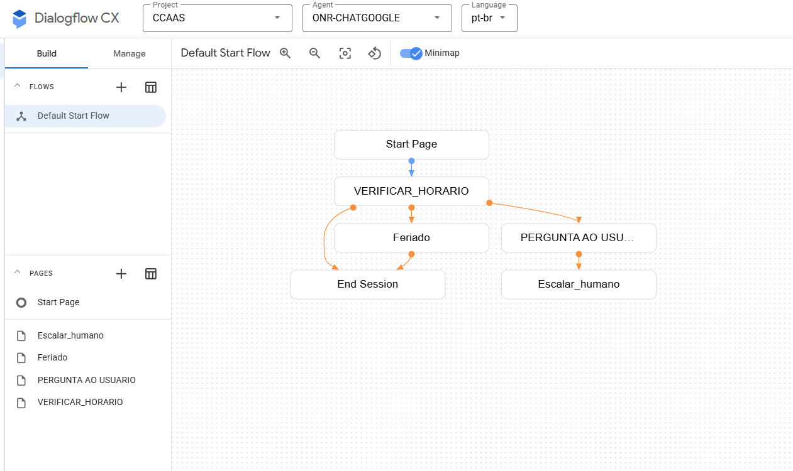
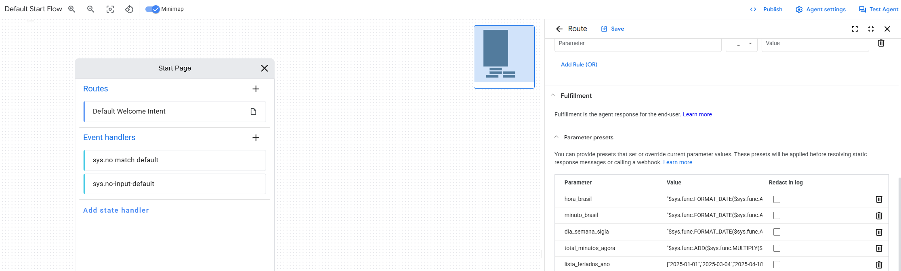
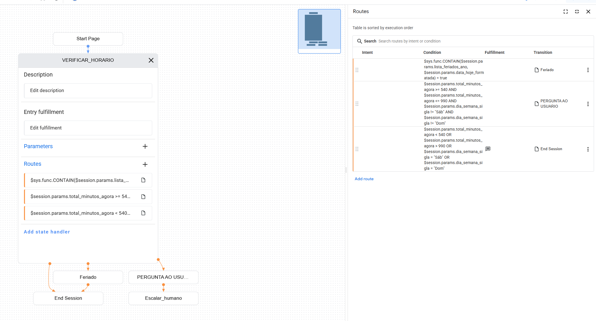
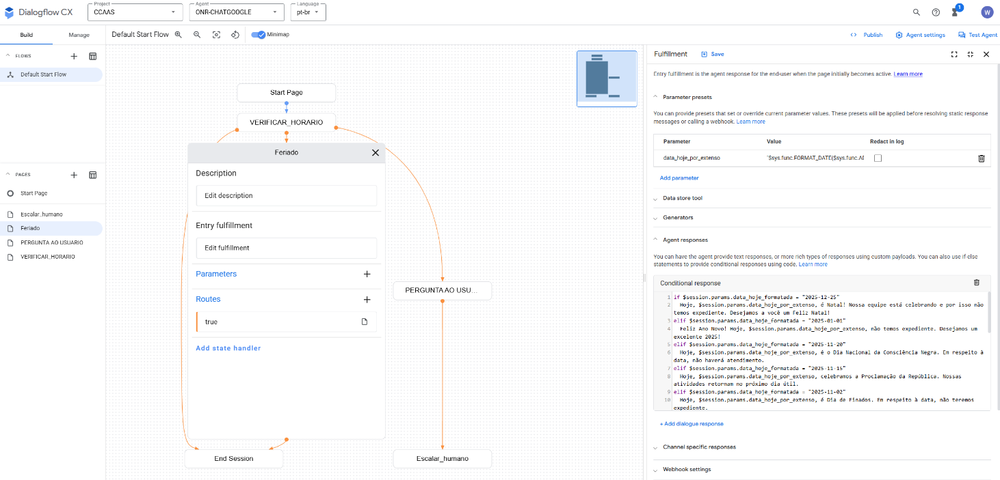

# Documentação Técnica - Integração Google Chat + CCAI

## Visão Geral

Este projeto integra o Google Chat com o Contact Center AI (CCAI) da Google, permitindo que usuários conversem com um chatbot (Dialogflow) e, quando necessário, sejam transferidos para um agente humano. O backend gerencia sessões, encaminha mensagens, trata anexos, controla o fluxo entre bot e humano e implementa lógica de fila e monitoramento.

---

## Arquitetura e Componentes

- **Flask API**: Backend principal, expõe rotas REST para integração com Google Chat e CCAI.
- **CCAIChatClient**: Classe para comunicação com a API do CCAI, incluindo criação de chats, envio de mensagens textuais e gerenciamento de escalonamento.
- **CCAIChatMediaManager**: Classe exclusiva para upload, registro e roteamento de mídias (imagens, vídeos, áudios, documentos) para o bucket GCS e para o CCAI.
- **user_chat_map**: Dicionário em memória que mapeia cada usuário para seu chat_id, status, fila, agente, etc.
- **Fila Monitor**: Thread em background que monitora usuários na fila de atendimento humano, enviando lembretes e mensagens automáticas.
- **Mensagens Customizadas**: Mensagens de sistema configuráveis via arquivo `messages.json`.

---

## Estrutura de Pastas e Arquivos

```
project-root/
├── clients/                                       # Módulos para comunicação com serviços externos.
│   ├── ccai_client.py                             # Cliente para API do Dialogflow CX (CCAI).
│   ├── __init__.py                                # Inicializa o pacote Python.
│   └── media_manager.py                           # Gerencia upload/download e tratamento de mídias.
├── handlers/                                      # Manipuladores de eventos e requisições recebidas.
│   ├── ccai_webhook_handler.py                    # Trata eventos recebidos via webhook do CCAI.
│   ├── google_chat_handler.py                     # Processa mensagens vindas do Google Chat.
│   └── send_message_handler.py                    # Controla o envio de mensagens pela aplicação.
├── keys/                                          # Armazena credenciais e chaves de acesso.
│   └── ccaas-conversational-ai-31a2edde3a60.json  # Chave de autenticação do CCAI.
├── routes/                                        # Define as rotas da API Flask.
│   ├── ccai_webhook.py                            # Rota de entrada dos webhooks do CCAI.
│   ├── googlechat.py                              # Rota para mensagens do Google Chat.
│   └── send_message.py                            # Rota para envio programático de mensagens.
├── services/                                      # Regras e lógicas de negócio da aplicação.
│   ├── ccai_events.py                             # Interpreta e trata eventos do CCAI.
│   └── escalation.py                              # Regras de escalonamento de atendimento.
├── utils/                                         # Funções utilitárias de apoio ao sistema.
│   ├── attachment_processor.py                    # Processa anexos de mensagens.
│   ├── cards.py                                   # Criação e formatação de cartões interativos.
│   ├── commands.py                                # Interpreta e trata comandos do usuário.
│   ├── fila.py                                    # Funções relacionadas a gerenciamento de filas.
│   ├── media_utils.py                             # Funções auxiliares para manipulação de mídia.
│   ├── message_sender.py                          # Envio de mensagens padronizadas.
│   └── user_map.py                                # Mapeamento de IDs e perfis de usuários.
├── .env                                           # Variáveis de ambiente (configurações sensíveis).
├── app.py                                         # Arquivo principal que inicia a aplicação Flask.
├── config.py                                      # Configurações globais da aplicação.
├── docker-compose.yml                             # Orquestração de serviços com Docker.
├── Dockerfile                                     # Define como construir a imagem Docker do app.
├── messages.json                                  # Modelos e templates de mensagens usadas.
└── requirements.txt                               # Lista de dependências Python do projeto.
```

---

## Variáveis de Ambiente (.env)

- `SERVICE_ACCOUNT_FILE`: Caminho para a conta de serviço Google
- `SCOPES`: Escopo de autenticação do bot
- `BUCKET_NAME`: Bucket GCS para mídia
- `CCAI_BASE_URL`, `CCAI_USERNAME`, `CCAI_PASSWORD`, `CCAI_MENU_ID`: Configuração do CCAI
- `URL_GOOGLE_CHAT`: URL base do endpoint do Google Chat
- `PORT`: Porta do Flask

---

## Endpoints da API

- `POST /api/v1/googlechat` — Recebe mensagens do usuário (Google Chat)
- `POST /api/v1/ccai-webhook` — Recebe eventos do CCAI (webhooks)
- `POST /api/v1/send-message` — (opcional) Envia mensagem para o Google Chat

---


## Fluxo de Conversa e Escalonamento

1. **Usuário inicia conversa no Google Chat**
   - `/api/v1/googlechat` recebe a mensagem
   - Se não houver chat ativo, cria novo chat no CCAI e inicia com o bot.
2. **Bot responde normalmente**
   - Mensagens são encaminhadas para o CCAI, que responde via webhook.
3. **Escalonamento para humano**
   - Quando o Dialogflow/CCAI decide escalar, envia evento `escalation_started`/`escalation_accepted`
   - O status do usuário vira `escalated`/`connected`
   - Mensagens do usuário são encaminhadas ao agente humano.
   - O monitor de fila envia lembretes automáticos caso não tenha atendimento ou espere a resposta do usuário.
4. **Encerramento de chat**
   - Se o agente ou o sistema encerra o chat (`chat_ended` ou `participant_left` do agent), o mapeamento é limpo
   - Nova mensagem do usuário inicia novo chat com o bot.

---

## Funções e Classes

### clients/ccai_client.py (CCAIChatClient)
- Métodos para criar, atualizar, escalar, enviar mensagens textuais e consultar chats no CCAI.
- Responsável apenas pela comunicação textual e autenticação com a API do CCAI.

---

### clients/init.py
- `initialize_clients`: Inicializa autenticação, CCAIChatClient e CCAIChatMediaManager.

---

### clients/media_manager.py (CCAIChatMediaManager)
Centraliza toda a lógica de upload, registro e roteamento de mídias (imagens, vídeos, áudios, documentos) tanto para o bucket do Google Cloud Storage quanto para o chat do CCAI.

**Principais responsabilidades:**
- Upload de mídias para o bucket GCS.
- Geração de Signed URLs para acesso seguro às mídias.
- Upload para o CCAI via URLs pré-assinadas.
- Envio de mensagens com mídias para o chat do CCAI.
- Encurtamento de links para documentos.
- Tratamento de erros e auditoria de uploads.

**Principais métodos:**
- `upload_and_add_photo`: Upload de imagem para bucket e CCAI, envio no chat.
- `upload_and_add_video`: Upload de vídeo para bucket e CCAI, envio no chat.
- `upload_and_add_document`: Upload de documento para bucket, geração de link curto e envio no chat.
- `add_uploaded_photo`, `add_uploaded_video`: Registro de mídias previamente enviadas via URL pré-assinada.
- `set_pre_signed_photo_url`, `set_pre_signed_video_upload_url`: Obtém URLs pré-assinadas para upload de mídias no CCAI.
- `get_all_photos`: Lista todas as fotos de um chat.

> **Importante:**  
> Todo o fluxo de upload, registro e envio de mídias deve ser feito via `CCAIChatMediaManager`.  
> O `CCAIChatClient` não gerencia anexos/mídias.

---

### handlers/

O diretório `handlers/` centraliza a lógica de manipulação dos eventos e requisições recebidas pela aplicação, servindo como ponte entre as rotas Flask e as regras de negócio. Cada arquivo é responsável por um tipo específico de evento ou fluxo:

- **ccai_webhook_handler.py**  
  Trata eventos recebidos via webhook do CCAI, como mensagens do bot, início de escalonamento, aceitação de agente humano, encerramento de chat e outros eventos do ciclo de atendimento. Realiza parsing dos eventos, atualiza o status do usuário e aciona as funções apropriadas nos serviços e utils.

- **google_chat_handler.py**  
  Processa mensagens recebidas do Google Chat, identifica comandos, trata anexos, inicia chats no CCAI, encaminha mensagens para o bot ou agente humano e gerencia o fluxo de conversação do usuário.

- **send_message_handler.py**  
  Controla o envio de mensagens programáticas pela aplicação, seja para o Google Chat ou para o CCAI, permitindo integrações externas ou automações internas dispararem mensagens paraa usuários ou agentes.

---

### keys/

O diretório `keys/` é responsável por armazenar credenciais e chaves sensíveis necessárias para a autenticação com serviços externos, especialmente o Google Cloud e o CCAI.

- **ccaas-conversational-ai-31a2edde3a60.json**  
  Arquivo de chave de conta de serviço do Google Cloud (Service Account).  
  Ele é utilizado para autenticação segura da aplicação com as APIs do Google, incluindo acesso ao bucket do Google Cloud Storage e integração com o CCAI.

---

### routes/

O diretório `routes/` define as rotas da API Flask, organizando os pontos de entrada HTTP da aplicação. Cada arquivo é responsável por um conjunto de endpoints relacionados a um fluxo ou integração específica:

- **ccai_webhook.py**  
  Define a rota de entrada dos webhooks do CCAI (`/api/v1/ccai-webhook`). Recebe eventos do CCAI, como mensagens do bot, escalonamento, aceitação de agente humano e encerramento de chat, encaminhando-os para os handlers apropriados.

- **googlechat.py**  
  Define a rota para mensagens recebidas do Google Chat (`/api/v1/googlechat`). Recebe mensagens dos usuários, comandos e anexos, encaminhando-os para processamento e resposta.

- **send_message.py**  
  Define a rota para envio programático de mensagens (`/api/v1/send-message`). Permite que integrações externas ou automações internas disparem mensagens para usuários ou agentes via Google Chat ou CCAI.

---

### services/

O diretório `services/` concentra as regras e lógicas de negócio da aplicação, separando a lógica central dos handlers e rotas. Cada arquivo é responsável por um aspecto específico do fluxo de atendimento:

- **ccai_events.py**  
  Interpreta e trata eventos recebidos do CCAI, como mensagens do bot, início e aceitação de escalonamento, encerramento de chat e outros eventos do ciclo de atendimento. Realiza parsing dos eventos, atualiza o status do usuário e aciona as funções apropriadas nos handlers, utils ou clients.

- **escalation.py**  
  Implementa as regras de escalonamento de atendimento, determinando quando e como um usuário deve ser transferido do bot para um agente humano. Gerencia o status de escalonamento, fila de espera, critérios de prioridade e lógica de retorno ao atendimento automatizado quando necessário.

---

### utils/

O diretório `utils/` concentra funções auxiliares e utilitários que apoiam o fluxo principal da aplicação. Veja o papel de cada arquivo:

- **attachment_processor.py**  
  Processa anexos recebidos do Google Chat, identifica tipo de mídia (imagem, vídeo, áudio, documento), prepara para upload e aciona o `CCAIChatMediaManager` para roteamento correto.

- **cards.py**  
  Responsável pela criação e formatação de cards interativos do Google Chat (ex: cards de suporte, treinamentos, notícias, plataformas), incluindo botões, imagens e links.

- **commands.py**  
  Interpreta comandos enviados pelo usuário (ex: `/ajuda`, `/contatosuporte`, `/notícias`, `/plataformas`, `/treinamentos`), roteando para a resposta ou card adequado.

- **fila.py**  
  Funções para gerenciamento de fila de atendimento humano, incluindo lógica de monitoramento, atualização de status e envio de lembretes automáticos.

- **media_utils.py**  
  Funções auxiliares para manipulação de arquivos de mídia, como geração de nomes únicos, validação de tipos, extração de metadados e suporte ao upload.

- **message_sender.py**  
  Centraliza o envio de mensagens padronizadas para o usuário, seja via Google Chat ou CCAI, incluindo mensagens de sistema, notificações e respostas automáticas.

- **user_map.py**  
  Gerencia o mapeamento de IDs e perfis de usuários, status de chat, fila, agente responsável, além de funções para verificar escalonamento e atualizar o mapa em memória.

---

### .env

O arquivo `.env` armazena variáveis de ambiente sensíveis e configurações necessárias para o funcionamento da aplicação. Ele é lido automaticamente no início da execução para configurar credenciais, endpoints e parâmetros do ambiente.

Principais variáveis:

- **SERVICE_ACCOUNT_FILE**: Caminho para o arquivo de conta de serviço do Google Cloud.
- **SCOPES**: Escopos de autenticação necessários para o bot e integração com APIs Google.
- **BUCKET_NAME**: Nome do bucket do Google Cloud Storage utilizado para armazenar mídias.
- **CCAI_BASE_URL**: URL base da API do CCAI.
- **CCAI_USERNAME**: Usuário para autenticação na API do CCAI.
- **CCAI_PASSWORD**: Senha para autenticação na API do CCAI.
- **CCAI_MENU_ID**: ID do menu ou fluxo padrão do CCAI.
- **URL_GOOGLE_CHAT**: URL base do endpoint do Google Chat (webhook).
- **PORT**: Porta em que o servidor Flask será iniciado.

---

### app.py
- Inicializa o Flask, carrega variáveis de ambiente, registra blueprints e inicializa os clients.

---

### config.py

O arquivo `config.py` centraliza configurações globais e constantes da aplicação. Ele pode ser utilizado para definir parâmetros padrão, caminhos, chaves de configuração, opções de debug, timeout, entre outros.

Principais usos:

- Definir configurações que podem ser importadas em diferentes módulos do projeto.
- Facilitar a alteração de parâmetros sem necessidade de modificar múltiplos arquivos.
- Padronizar valores de timeout, limites de tamanho de upload, formatos de data/hora, etc.
- Carregar e validar variáveis de ambiente, se necessário.

---

## Gerenciamento de Sessão e Status

- `user_chat_map`: Mapeia cada usuário para seu chat_id, status, fila, agente, etc.
- Status possíveis: `bot`, `escalated`, `connected`, `finished`
- O mapeamento é limpo apenas em eventos de encerramento real.
- O usuário nunca fica "preso" em status errado: sempre volta para o bot após o encerramento.

---

## Tratamento de Anexos

- Imagens, vídeos, áudios e documentos são tratados e enviados para o CCAI conforme o tipo.
- O upload, registro e envio de mídias é feito exclusivamente pelo `CCAIChatMediaManager`.
- Uploads são feitos para bucket GCS, com geração de Signed URLs válidas por 5 horas.
- Documentos e mídias são enviados ao agente humano via CCAI, com links encurtados quando necessário.

---

## Mensagens Customizadas

- Mensagens de sistema (ex: "Você está na fila", "Chat finalizado") são carregadas do arquivo `messages.json` e podem ser personalizadas.
- O sistema permite fácil alteração de textos sem necessidade de alterar código.

---

## Comandos Especiais e Funcionalidades (Slash Commands)

- Comandos `/ajuda`, `/contatosuporte`, `/notícias`, `/plataformas`, `/treinamentos` disponíveis para o usuário.
- Comando `/fim` permite ao usuário encerrar o chat manualmente. (Este comando não está visível para o usuário.)
- Fila monitor envia lembretes automáticos para usuários aguardando agente humano.

---

## Cards Interativos

Os comandos retornam cards interativos (Google Chat cards) com botões, imagens, links e informações úteis. Os cards são definidos em `utils/cards.py` e incluem:

- **card_contato_suporte**: Card com canais de contato, botões para e-mail e site.
- **gerar_card_treinamento**: Card com agenda de treinamentos e botão para agendar.
- **card_notícias**: Card com novidades e botão para acessar notícias.
- **gerar_card_plataformas**: Card com lista de plataformas digitais e botões de acesso rápido.

A lógica de roteamento dos comandos e cards está centralizada na função `process_command` em `utils/commands.py`, que interpreta o comando e retorna o card ou resposta adequada.

---

## Como Rodar

1. Configure o arquivo `.env` com as variáveis necessárias (credenciais, URLs, etc).
2. Certifique-se de ter o arquivo `messages.json` com as mensagens do sistema.
3. Execute:
   ```bash
   python app.py
   ```
4. O serviço ficará disponível nas rotas:
   - `/api/v1/googlechat`
   - `/api/v1/ccai-webhook`
   - `/api/v1/send-message`

---

## Dependências

- Python 3.12+
- Flask
- google-cloud-storage
- requests
- python-dotenv

Instale com:
```bash
pip install -r requirements.txt
```

---

## FAQ

**1. Como personalizar mensagens do sistema?**
- Edite o arquivo `messages.json` para alterar textos de fila, encerramento, etc.

**2. Como adicionar um novo comando?**
- Implemente em `utils/commands.py` e adicione ao dicionário de comandos.

**3. Como tratar novos tipos de anexo?**
- Atualize a função de identificação de mídia e implemente o tratamento em `utils/attachment_processor.py` e no `CCAIChatMediaManager`.

**4. Como rodar em produção?**
- Use Docker/Docker Compose, configure variáveis de ambiente e utilize um WSGI server (ex: gunicorn)

---

## Arquitetura do Fluxo de Interação no Dialogflow CX (Antes da Escalada para o Humano)

Para otimizar o atendimento e garantir que os agentes humanos sejam acionados apenas quando estritamente necessário, o agente Dialogflow CX foi desenhado com uma arquitetura inteligente de pré-escalada, focando em verificações automáticas e respostas precisas. O agente foi cuidadosamente estruturado para realizar verificações automáticas cruciais antes de considerar a escalada da conversa para um atendente humano. Esse processo garante que o usuário receba a resposta mais adequada e que os atendentes sejam acionados apenas quando necessário.

---

### 1. Visão Geral do Fluxo Principal

A figura abaixo apresenta o mapa geral do fluxo, mostrando a sequência de páginas e as possíveis transições.


*Figura 1: Fluxo Dialogflow CX*

- **Start Page**: É o ponto de entrada da conversa.
- **VERIFICAR_HORARIO**: Primeira página para onde o fluxo é direcionado. Aqui, são feitas as verificações iniciais de horário de atendimento.
- **Feriado**: Se a verificação indicar que é um feriado, o fluxo transita para esta página para uma resposta específica.
- **PERGUNTA AO USUARIO**: Se o horário estiver dentro do expediente e não for feriado, o fluxo segue para esta página, onde o bot interage diretamente com o usuário para entender sua necessidade.
- **End Session**: Representa o encerramento da sessão, geralmente após uma resposta de feriado ou um atendimento concluído.
- **Escalar_humano**: O ponto para onde o fluxo se direciona caso a conversa precise ser escalada para um agente humano, após a página "PERGUNTA AO USUARIO".

Este diagrama ilustra o caminho que a interação do usuário pode seguir, com decisões automatizadas que direcionam para diferentes respostas ou ações.

---

### 2. Definição de Parâmetros Iniciais

A figura abaixo demonstra a "Start Page" e, em particular, na seção de "Parameter presets". É aqui que as variáveis de sessão essenciais para as verificações de horário e feriados são inicializadas.


*Figura 2: Start Page*

- **hora_brasil**: Define a hora atual formatada.
- **minuto_brasil**: Define o minuto atual formatado.
- **dia_semana_sigla**: Obtém a sigla do dia da semana atual (por exemplo, "Dom" para domingo).
- **total_minutos_agora**: Calcula o total de minutos desde o início do dia, um valor crucial para as regras de horário de atendimento.
- **lista_feriados_ano**: Um array que contém as datas dos feriados nacionais no formato YYYY-MM-DD. Esta variável é fundamental para a verificação de feriados.

Esses parâmetros são definidos no início da sessão, garantindo que as informações de tempo e datas estejam disponíveis para as verificações subsequentes.

---

### 3. Página "VERIFICAR_HORARIO" e Regras de Roteamento

A figura abaixo detalha a página "VERIFICAR_HORARIO", mostrando as rotas e condições que definem o fluxo da conversa.


*Figura 3: VERIFICAR_HORARIO Page*

- **Verificação de Horário de Atendimento**:
  - O sistema checa se o horário atual está dentro do expediente configurado utilizando a variável `$session.params.total_minutos_agora`. As regras de horário são expressas em minutos, por exemplo, `total_minutos_agora >= 540` (09:00) e `total_minutos_agora <= 990` (16:30).
  - Além disso, as regras excluem automaticamente os finais de semana verificando se `$session.params.dia_semana_sigla` NÃO CONTÉM "Sáb" OU "Dom".
- **Verificação de Feriado**:
  - Uma das rotas principais verifica se a data atual (`$session.params.data_hoje_formatada`) está contida na variável `$session.params.lista_feriados_ano`. A condição para esta rota é: `Sys.func.CONTAINS($session.params.lista_feriados_ano, $session.params.data_hoje_formatada)`.
  - Se for feriado, o fluxo transita para a página "Feriado".
- **Saudação e Pergunta ao Usuário**:
  - Se as condições de feriado e horário de atendimento forem atendidas (ou seja, não é feriado e está dentro do expediente), o fluxo transita para a página "PERGUNTA AO USUARIO", onde o bot saúda o usuário e pergunta sua dúvida.

---

### 4. Tratamento de Feriados e Mensagens Personalizadas

A figura abaixo complementa a visão da página "VERIFICAR_HORARIO", mostrando a seção de "Fulfillment" e as "Conditional Responses" utilizadas para personalizar as mensagens.


*Figura 4: Feriado Page*

- **Respostas Personalizadas para Feriados**:
  - Dentro do bloco de Conditional Response, são utilizadas estruturas if-else para verificar a `$session.params.data_hoje_formatada` e fornecer mensagens específicas para feriados como Natal, Ano Novo, Finados, etc.
  - Por exemplo, se a data for "2023-12-25", a resposta será "Feliz Natal!". Se for "2024-01-01", "Feliz Ano Novo!".
  - Caso não seja um feriado específico com mensagem personalizada, há uma mensagem genérica para feriados.

---

### Regras de Negócio Utilizadas

- **Horário de Atendimento**: Controlado por faixas de minutos (ex: 540 a 990 minutos para 09:00 às 16:30) e exclusão de dias da semana (sábado e domingo).
- **Verificação de Feriado**: Baseada na função `Sys.func.CONTAINS` que busca a data atual formatada (YYYY-MM-DD) dentro do array `$session.params.lista_feriados_ano`.

---

### Como Atualizar a Lista de Feriados

A variável `$session.params.lista_feriados_ano` é um array que armazena as datas dos feriados no formato YYYY-MM-DD. Para incluir ou remover um feriado, basta editar este array no Dialogflow CX, adicionando ou removendo a data desejada.

- Exemplo: `Sys.func.CONTAINS($session.params.lista_feriados_ano, $session.params.data_hoje_formatada)` verifica se a data de hoje está na lista de feriados.

---